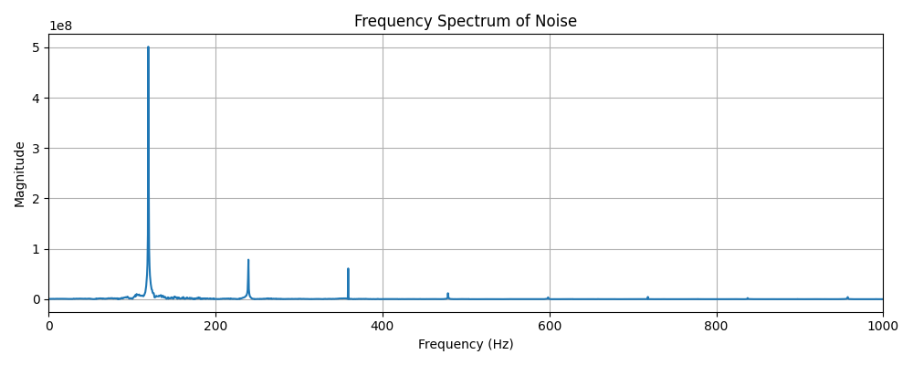

# fft_spectgram

## Usage

git clone https://github.com/yamashin0922/fft_spectgram.git

cd fft_spectgram

pip install pydub matplotlib scipy # インストールされていなければ

python fft_spectgram.py

## 周波数スペクトル解析

以下は Laney RB2 のノイズを FFT で解析したスペクトルです：

